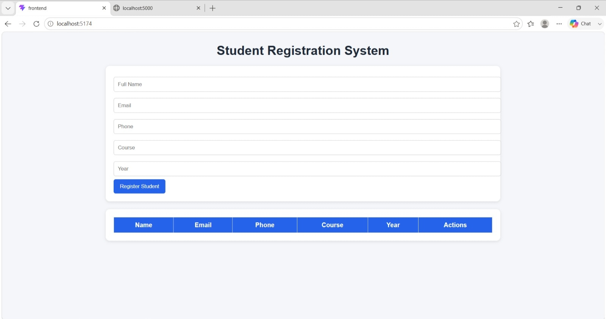
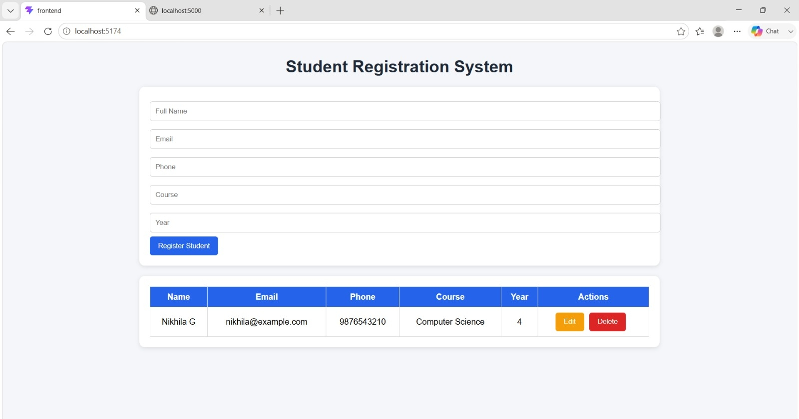
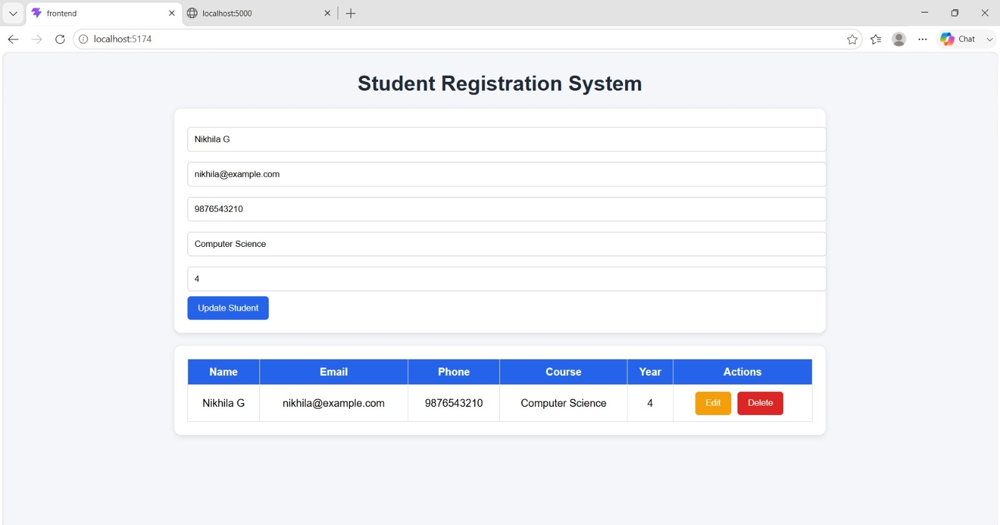
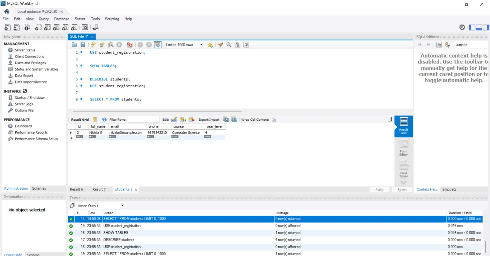

# Student Registration System

## Description
A full-stack Student Registration System built using React, Express.js, and MySQL.

## Features
- Register students
- View all students
- Update student information
- Delete student records
- Input validation
- Success and error messages
- Loading indicator

## Technologies Used
- React
- Express.js
- Node.js
- MySQL
- Axios

## Installation

### Backend
```bash
cd backend
npm install
npm run dev
```

### Frontend
```bash
cd frontend
npm install
npm run dev
```
## Output Screenshots

### Home Page


### Student List


### Update Student


### Database

